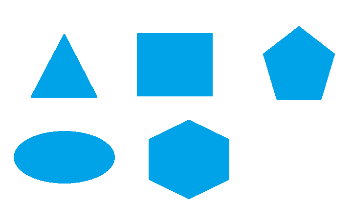

# Simple Shape Detection

Polygon detection and classification using OpenCV contour analysis.



## How It Works

1. Convert input image to grayscale and apply binary thresholding
2. Find contours with `cv2.findContours`
3. Filter out small contours (noise) by area
4. Approximate each contour to a polygon using the Douglas-Peucker algorithm
5. Classify by vertex count and geometry:
   - **3 vertices** → Triangle
   - **4 vertices** → Square or Rectangle (distinguished by aspect ratio)
   - **5 vertices** → Pentagon
   - **6 vertices** → Hexagon
   - **More** → Circle
6. Draw each shape with a distinct color and label

## Usage

```bash
pip install opencv-python numpy
python simple_shape_detection.py              # defaults to polygons.png
python simple_shape_detection.py myimage.png  # custom image
```

## Dependencies

- OpenCV
- NumPy

## License

MIT
